# Mobilerun — Architecture Diagram

All modules and their relationships.

```mermaid
flowchart TB
    %% ── Entry Points ──────────────────────────────────────────────────────────
    subgraph ENTRY["① Entry Points"]
        direction LR
        CLI_MAIN["CLI\ncli/main.py\n(Click)"]
        SDK_API["Python SDK\nfrom mobilerun import MobileAgent"]
    end

    %% ── CLI Layer ─────────────────────────────────────────────────────────────
    subgraph CLI_LAYER["② CLI Layer  cli/"]
        direction LR
        TUI["TUI App\ntui/app.py\n(Textual)\n· widgets/\n· settings/\n· commands.py"]
        WIZARD["Configure Wizard\nconfigure_wizard.py\nconfigure_prompts.py"]
        DOCTOR["Doctor\ndoctor.py\nlogs.py"]
        OAUTH_A["OAuth Actions\noauth_actions.py"]
        DEV_CMD["Device Commands\ndevice_commands.py\nevent_handler.py"]
        MACRO_C["Macro CLI\nmacro/cli.py"]
    end

    %% ── Core Orchestration ────────────────────────────────────────────────────
    subgraph ORCH["③ Core Orchestration  agent/droid/"]
        MA["MobileAgent\ndroid_agent.py\n(llama-index Workflow)"]
        SHARED["MobileAgentState\nstate.py\n· step counter\n· action history\n· error flags\n· pending messages"]
        DROID_EVT["Workflow Events\nevents.py\nManagerInput/Plan\nExecutorInput/Result\nFastAgentExecute/Result\nFinalize · Result"]
    end

    %% ── Agents ────────────────────────────────────────────────────────────────
    subgraph AGENTS["④ Agents"]
        subgraph REASON_AGENTS["Reasoning Mode"]
            MGR["ManagerAgent\nagent/manager/manager_agent.py\n(stateful — chat memory)"]
            SMGR["StatelessManagerAgent\nagent/manager/stateless_manager_agent.py\n(no chat history)"]
            EXE["ExecutorAgent\nagent/executor/executor_agent.py\n(executes one action/step)"]
        end
        subgraph DIRECT_AGENTS["Direct Mode"]
            FA["FastAgent\nagent/fast_agent/fast_agent.py\n(XML tool-call loop)\nxml_parser.py"]
        end
        subgraph SPECIAL_AGENTS["Specialized"]
            SOA["StructuredOutputAgent\nagent/oneflows/structured_output_agent.py\n(typed Pydantic extraction)"]
            EXT_A["External Agents\nagent/external/\n(3rd-party agent plugins)"]
        end
    end

    %% ── Coordination Layer ────────────────────────────────────────────────────
    subgraph COORD["⑤ Coordination"]
        AC["ActionContext\nagent/action_context.py\n(dependency bag:\ndriver · ui · state\nstate_provider · creds\napp_opener_llm)"]
        REG["ToolRegistry\nagent/tool_registry.py\n(central tool catalogue\nwith capability filter)"]
        SIG["build_tool_registry\nagent/utils/signatures.py"]
        ACTS["Action Functions\nagent/utils/actions.py\nclick · long_press · type\nswipe · open_app · swipe\nremember · complete · wait\n+ type_secret · click_at …"]
        USAGE["Token Usage Tracking\nagent/usage.py"]
    end

    %% ── Device Layer ──────────────────────────────────────────────────────────
    subgraph DEVICE_LAYER["⑥ Device Layer"]
        subgraph DRIVERS["Drivers  tools/driver/"]
            BASE_DRV["DeviceDriver ABC\nbase.py\n(capability sets:\nsupported · supported_buttons)"]
            ADRV["AndroidDriver\nandroid.py\n(async_adbutils / ADB)"]
            IDRV["IOSDriver\nios.py\n(HTTP to Portal)"]
            VRDRV["VisualRemoteDriver\nvisual_remote.py\n(cloud control)"]
            SDRV["StealthDriver\nstealth.py\n(wrapper — hides ADB artifacts)"]
            RDRV["RecordingDriver\nrecording.py\n(wrapper — logs for macro)"]
        end
        subgraph SP["State Providers  tools/ui/"]
            BASE_SP["StateProvider ABC\nprovider.py"]
            ANDSP["AndroidStateProvider\nprovider.py\n(accessibility tree)"]
            IOSSP["IOSStateProvider\nios_provider.py"]
            SCRNSP["ScreenshotOnlyProvider\nscreenshot_provider.py\n(vision-only / no tree)"]
            UI_STATE["UIState\nstate.py · stealth_state.py"]
        end
        subgraph UI_PROC["UI Processing"]
            FLTS["Filters  tools/filters/\nDetailedFilter\nConciseFilter"]
            FMTS["Formatters  tools/formatters/\nIndexedFormatter"]
            HLPS["Helpers  tools/helpers/\ngeometry.py · images.py\nelement_search.py\ncoordinate.py"]
        end
        PORTAL["Android Portal Client\ntools/android/portal_client.py\nportal.py"]
        IOS_T["iOS Tools\ntools/ios/"]
    end

    %% ── Configuration ─────────────────────────────────────────────────────────
    subgraph CFG_LAYER["⑦ Configuration  config_manager/"]
        CFGMGR["ConfigManager · loader.py\npath_resolver.py · migrations/"]
        MCFG["MobileConfig (dataclasses)\nconfig_manager.py\nAgentConfig · DeviceConfig\nToolsConfig · LoggingConfig\nTracingConfig · TelemetryConfig\nCredentialsConfig · MCPConfig"]
        LLMP["LLMProfile → LLMs\nconfig_manager.py\nagent/utils/llm_loader.py\nagent/utils/llm_picker.py"]
        PROV_REG["Provider Registry\nagent/providers/registry.py\nsetup_service.py · types.py"]
        PR["PromptResolver\nagent/utils/prompt_resolver.py"]
        TMPLS["Jinja2 Templates\nconfig/prompts/\n  executor/\n  fast_agent/\n  manager/"]
        ACARDS["AppCardProvider\napp_cards/app_card_provider.py\napp_cards/providers/\nconfig/app_cards/ (JSON)"]
        ENV_KEYS["env_keys.py\ncredential_paths.py"]
    end

    %% ── Supporting Systems ────────────────────────────────────────────────────
    subgraph SUPPORT["⑧ Supporting Systems"]
        CRED["CredentialManager\ncredential_manager/\ncredential_manager.py\nfile_credential_manager.py\n(YAML secret store)"]
        MCP_MOD["MCP Integration  mcp/\nclient.py · adapter.py\nconfig.py\n(Model Context Protocol)"]
        TEL["Telemetry  telemetry/\ntracker.py · events.py\n(PostHog)"]
        TRCG["Tracing\nagent/utils/tracing_setup.py\ntelemetry/phoenix.py\ntelemetry/langfuse_processor.py\n(OpenTelemetry · Phoenix · Langfuse)"]
        TRAJ["Trajectory\nagent/trajectory/writer.py\nagent/utils/trajectory.py\n(step-by-step run record\n+ GIF generation)"]
        MAC_R["Macro Replay\nmacro/replay.py · macro/cli.py\n(replays RecordingDriver log)"]
        CHAT["Chat Utilities\nagent/utils/chat_utils.py\nagent/utils/inference.py"]
        LOGH["Log Handlers\nlog_handlers.py\n(CLILogHandler · rich)"]
        OAUTH_MOD["OAuth  agent/utils/oauth/\nOpenAI · Anthropic · Gemini"]
    end

    %% ── LLM Providers ─────────────────────────────────────────────────────────
    subgraph LLM_LAYER["⑨ LLM Providers  via llama-index"]
        direction LR
        OAI["OpenAI\nllama-index-llms-openai"]
        ANT["Anthropic\nllama-index-llms-anthropic"]
        GEM["Google Gemini\nllama-index-llms-google-genai"]
        OLL["Ollama\nllama-index-llms-ollama"]
        MISC["DeepSeek · OpenRouter\nOpenAI-like transport"]
    end

    %% ── External / Physical ───────────────────────────────────────────────────
    subgraph PHYS["⑩ External"]
        direction LR
        ADEV["Android Device\nADB"]
        IDEV["iOS Device\nPortal APK"]
        CDEV["Cloud / Visual Remote\nHTTP"]
    end

    %% ── Compat ────────────────────────────────────────────────────────────────
    COMPAT["Compat Layer\ncompat/droidrun/\n(legacy droidrun imports\nDroidAgent alias)"]

    %% ══════════════════════════════════════════════════════════════════════════
    %% Edges
    %% ══════════════════════════════════════════════════════════════════════════

    %% Entry → CLI / Orchestration
    CLI_MAIN --> CLI_LAYER
    CLI_MAIN --> MA
    SDK_API  --> MA
    COMPAT   -.->|"re-exports"| MA

    %% CLI → Macro
    MACRO_C --> MAC_R

    %% Orchestration internals
    MA <-->|"reads/writes"| SHARED
    MA  -->|"emits typed"| DROID_EVT

    %% MA → Agents
    MA --> REASON_AGENTS
    MA --> FA
    MA --> SOA
    MA --> EXT_A

    %% MA → Coordination
    MA --> AC
    MA --> REG

    %% Agents → ActionContext
    REASON_AGENTS --> AC
    FA            --> AC
    SOA           --> AC

    %% Coordination internals
    REG --> SIG
    SIG --> ACTS
    ACTS --> AC
    AC  --> USAGE

    %% ActionContext → Drivers
    AC --> BASE_DRV
    BASE_DRV --- ADRV
    BASE_DRV --- IDRV
    BASE_DRV --- VRDRV
    ADRV --> SDRV
    ADRV --> RDRV

    %% Drivers → Physical
    ADRV --> ADEV
    IDRV --> IDEV
    VRDRV --> CDEV

    %% Drivers → Sub-tools
    ADRV --> PORTAL
    IDRV --> IOS_T

    %% StateProvider stack
    AC --> BASE_SP
    BASE_SP --- ANDSP
    BASE_SP --- IOSSP
    BASE_SP --- SCRNSP
    ANDSP --> FLTS
    ANDSP --> FMTS
    ANDSP --> HLPS
    ANDSP --> UI_STATE
    IOSSP --> UI_STATE
    SCRNSP --> UI_STATE

    %% RecordingDriver → Trajectory → Macro
    RDRV --> TRAJ
    TRAJ --> MAC_R

    %% Config chain
    MA --> CFGMGR
    CFGMGR --> MCFG
    MCFG --> LLMP
    LLMP --> PROV_REG
    PROV_REG --> LLM_LAYER
    LLMP --> OAUTH_MOD
    MA --> PR
    PR --> TMPLS
    MA --> ACARDS
    CFGMGR --> ENV_KEYS

    %% Supporting systems
    MA --> CRED
    MA --> MCP_MOD
    MA --> TEL
    MA --> TRCG
    MA --> TRAJ
    MA --> LOGH
    MCP_MOD --> REG
    CRED --> ACTS
    CHAT --> REASON_AGENTS
    CHAT --> FA

    %% Styles
    classDef entry    fill:#1a1a2e,stroke:#e94560,color:#fff
    classDef cli      fill:#16213e,stroke:#0f3460,color:#ddd
    classDef orch     fill:#0f3460,stroke:#e94560,color:#fff,font-weight:bold
    classDef agent    fill:#533483,stroke:#a682ff,color:#fff
    classDef coord    fill:#2d6a4f,stroke:#52b788,color:#fff
    classDef device   fill:#1b4332,stroke:#52b788,color:#ddd
    classDef cfg      fill:#3d405b,stroke:#81b29a,color:#fff
    classDef support  fill:#264653,stroke:#2a9d8f,color:#ddd
    classDef llm      fill:#2b2d42,stroke:#ef233c,color:#fff
    classDef phys     fill:#370617,stroke:#e85d04,color:#fff
    classDef compat   fill:#1a1a1a,stroke:#555,color:#aaa,stroke-dasharray:4 4

    class CLI_MAIN,SDK_API entry
    class TUI,WIZARD,DOCTOR,OAUTH_A,DEV_CMD,MACRO_C cli
    class MA,SHARED,DROID_EVT orch
    class MGR,SMGR,EXE,FA,SOA,EXT_A agent
    class AC,REG,SIG,ACTS,USAGE coord
    class BASE_DRV,ADRV,IDRV,VRDRV,SDRV,RDRV,BASE_SP,ANDSP,IOSSP,SCRNSP,UI_STATE,FLTS,FMTS,HLPS,PORTAL,IOS_T device
    class CFGMGR,MCFG,LLMP,PROV_REG,PR,TMPLS,ACARDS,ENV_KEYS cfg
    class CRED,MCP_MOD,TEL,TRCG,TRAJ,MAC_R,CHAT,LOGH,OAUTH_MOD support
    class OAI,ANT,GEM,OLL,MISC llm
    class ADEV,IDEV,CDEV phys
    class COMPAT compat
```

---

## Module Index

| # | Layer | Module | Path |
|---|-------|--------|------|
| ① | Entry | CLI (Click) | `mobilerun/cli/main.py` |
| ① | Entry | Python SDK | `from mobilerun import MobileAgent` |
| ② | CLI | TUI App (Textual) | `mobilerun/cli/tui/app.py` |
| ② | CLI | TUI Widgets | `mobilerun/cli/tui/widgets/` |
| ② | CLI | TUI Settings | `mobilerun/cli/tui/settings/` |
| ② | CLI | Configure Wizard | `mobilerun/cli/configure_wizard.py` |
| ② | CLI | Doctor / Diagnostics | `mobilerun/cli/doctor.py` |
| ② | CLI | OAuth Actions | `mobilerun/cli/oauth_actions.py` |
| ② | CLI | Device Commands | `mobilerun/cli/device_commands.py` |
| ② | CLI | Macro CLI | `mobilerun/macro/cli.py` |
| ③ | Orchestration | MobileAgent (Workflow) | `mobilerun/agent/droid/droid_agent.py` |
| ③ | Orchestration | MobileAgentState | `mobilerun/agent/droid/state.py` |
| ③ | Orchestration | Workflow Events | `mobilerun/agent/droid/events.py` |
| ④ | Agents | ManagerAgent | `mobilerun/agent/manager/manager_agent.py` |
| ④ | Agents | StatelessManagerAgent | `mobilerun/agent/manager/stateless_manager_agent.py` |
| ④ | Agents | ExecutorAgent | `mobilerun/agent/executor/executor_agent.py` |
| ④ | Agents | FastAgent | `mobilerun/agent/fast_agent/fast_agent.py` |
| ④ | Agents | FastAgent XML Parser | `mobilerun/agent/fast_agent/xml_parser.py` |
| ④ | Agents | StructuredOutputAgent | `mobilerun/agent/oneflows/structured_output_agent.py` |
| ④ | Agents | External Agent Loader | `mobilerun/agent/external/` |
| ⑤ | Coordination | ActionContext | `mobilerun/agent/action_context.py` |
| ⑤ | Coordination | ToolRegistry | `mobilerun/agent/tool_registry.py` |
| ⑤ | Coordination | build\_tool\_registry | `mobilerun/agent/utils/signatures.py` |
| ⑤ | Coordination | Action Functions | `mobilerun/agent/utils/actions.py` |
| ⑤ | Coordination | Token Usage | `mobilerun/agent/usage.py` |
| ⑥ | Device | DeviceDriver ABC | `mobilerun/tools/driver/base.py` |
| ⑥ | Device | AndroidDriver | `mobilerun/tools/driver/android.py` |
| ⑥ | Device | IOSDriver | `mobilerun/tools/driver/ios.py` |
| ⑥ | Device | VisualRemoteDriver | `mobilerun/tools/driver/visual_remote.py` |
| ⑥ | Device | StealthDriver | `mobilerun/tools/driver/stealth.py` |
| ⑥ | Device | RecordingDriver | `mobilerun/tools/driver/recording.py` |
| ⑥ | Device | Android Portal Client | `mobilerun/tools/android/portal_client.py` |
| ⑥ | Device | Portal Setup | `mobilerun/portal.py` |
| ⑥ | Device | iOS Tools | `mobilerun/tools/ios/` |
| ⑥ | Device | AndroidStateProvider | `mobilerun/tools/ui/provider.py` |
| ⑥ | Device | IOSStateProvider | `mobilerun/tools/ui/ios_provider.py` |
| ⑥ | Device | ScreenshotOnlyProvider | `mobilerun/tools/ui/screenshot_provider.py` |
| ⑥ | Device | UIState | `mobilerun/tools/ui/state.py` |
| ⑥ | Device | Filters (Concise/Detailed) | `mobilerun/tools/filters/` |
| ⑥ | Device | IndexedFormatter | `mobilerun/tools/formatters/` |
| ⑥ | Device | Helpers (geometry, images…) | `mobilerun/tools/helpers/` |
| ⑦ | Config | ConfigManager / Loader | `mobilerun/config_manager/loader.py` |
| ⑦ | Config | MobileConfig dataclasses | `mobilerun/config_manager/config_manager.py` |
| ⑦ | Config | Config Migrations | `mobilerun/config_manager/migrations/` |
| ⑦ | Config | LLMProfile + llm\_loader | `mobilerun/agent/utils/llm_loader.py` |
| ⑦ | Config | Provider Registry | `mobilerun/agent/providers/registry.py` |
| ⑦ | Config | PromptResolver | `mobilerun/agent/utils/prompt_resolver.py` |
| ⑦ | Config | Jinja2 Prompt Templates | `mobilerun/config/prompts/` |
| ⑦ | Config | AppCardProvider | `mobilerun/app_cards/app_card_provider.py` |
| ⑦ | Config | App Card JSON Files | `mobilerun/config/app_cards/` |
| ⑦ | Config | Env / API Key Sources | `mobilerun/config_manager/env_keys.py` |
| ⑧ | Support | CredentialManager | `mobilerun/credential_manager/` |
| ⑧ | Support | MCP Client + Adapter | `mobilerun/mcp/` |
| ⑧ | Support | Telemetry (PostHog) | `mobilerun/telemetry/tracker.py` |
| ⑧ | Support | Tracing (Phoenix/Langfuse) | `mobilerun/agent/utils/tracing_setup.py` |
| ⑧ | Support | Trajectory Writer | `mobilerun/agent/trajectory/writer.py` |
| ⑧ | Support | Macro Replay | `mobilerun/macro/replay.py` |
| ⑧ | Support | Chat / Inference Utils | `mobilerun/agent/utils/chat_utils.py` |
| ⑧ | Support | OAuth (OpenAI/Anthropic/Gemini) | `mobilerun/agent/utils/oauth/` |
| ⑧ | Support | Log Handlers | `mobilerun/log_handlers.py` |
| ⑨ | LLM | OpenAI | `llama-index-llms-openai` |
| ⑨ | LLM | Anthropic | `llama-index-llms-anthropic` (optional) |
| ⑨ | LLM | Google Gemini | `llama-index-llms-google-genai` |
| ⑨ | LLM | Ollama | `llama-index-llms-ollama` |
| ⑨ | LLM | DeepSeek / OpenRouter | `llama-index-llms-openai-like` / `openrouter` |
| ⑩ | External | Android Device | ADB |
| ⑩ | External | iOS Device | Portal APK (HTTP) |
| ⑩ | External | Cloud / Visual Remote | HTTP WebSocket |
| — | Compat | Legacy droidrun imports | `compat/droidrun/` |
